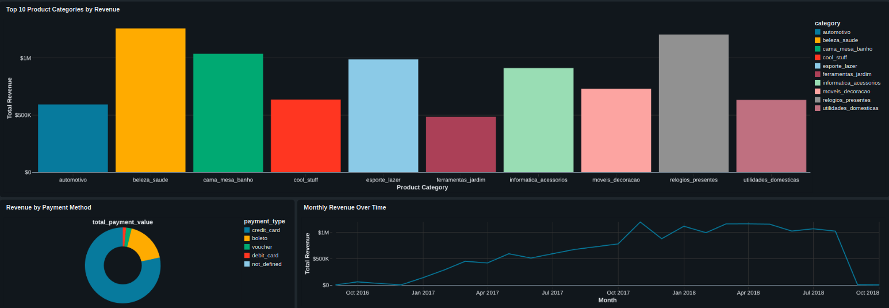

# E-commerce Data Engineering & Analytics — Databricks

An end-to-end data engineering and analytics project built in **Databricks** using the **Olist Brazilian E-commerce dataset**. The project implements a **Bronze–Silver–Gold Medallion Architecture** to transform raw e-commerce data into reliable, business-ready datasets for analytics and reporting.

### 🔧 Technologies

**Databricks · PySpark · SQL · Delta Lake · Medallion Architecture · Data Visualization**

### 🚀 Project Overview

* **Bronze Layer:** Ingested raw Olist transactional data into Delta tables while preserving the original source data.
* **Silver Layer:** Cleaned, standardized, validated, and transformed datasets using PySpark and SQL.
* **Gold Layer:** Created reusable, business-ready analytical datasets optimized for reporting and KPI analysis.
* **Data Integration:** Joined and transformed data across orders, customers, products, sellers, payments, and reviews.
* **Analytics & Visualization:** Developed dashboards to analyze monthly revenue trends, revenue by payment method, and the top 10 product categories by revenue.

### 📊 Key Outcomes

The project demonstrates an end-to-end data pipeline from **raw ingestion → data transformation → dimensional/business modeling → analytics and visualization**, following modern data engineering practices. The reusable Gold-layer datasets provide a foundation for business reporting, revenue analysis, and e-commerce KPI tracking.

### 🏗️ Architecture

**Raw Data → Bronze → Silver → Gold → Analytics & Dashboards**

This project showcases practical experience with **Databricks, distributed data processing with PySpark, SQL-based analytics, Delta Lake, and Medallion Architecture**.

📈 Dashboard

The dashboard below visualizes the key business metrics developed as part of the project, including:

   *  **Monthly revenue trends**
   *  **Revenue by payment method**
   *  **Top 10 product categories by revenue**

